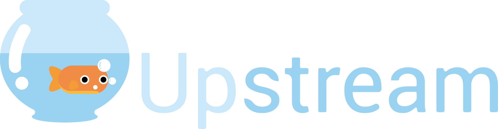

# Group-24-Project

## Upstream Kinoma App

### Group 24 Project: Gauthier Dieppedalle, Michelle Zhang, Tim Lim, Jessica He, Ahmed Husain

Give your fish a step up with Upstream!

Some people want to own fish, but may not have the lifestyle or the knowledge to properly take care of fish. If they are too busy, they can be careless and forget to feed their fish, or maintain their tank, and their careless mistakes could cost their fish their lives. With Upstream, owning a fish becomes so easy that anyone can do it, no matter their lifestyle. Upstream is a connected fish tank that monitors your fish’s health and keeps track of the variables in your tank.
